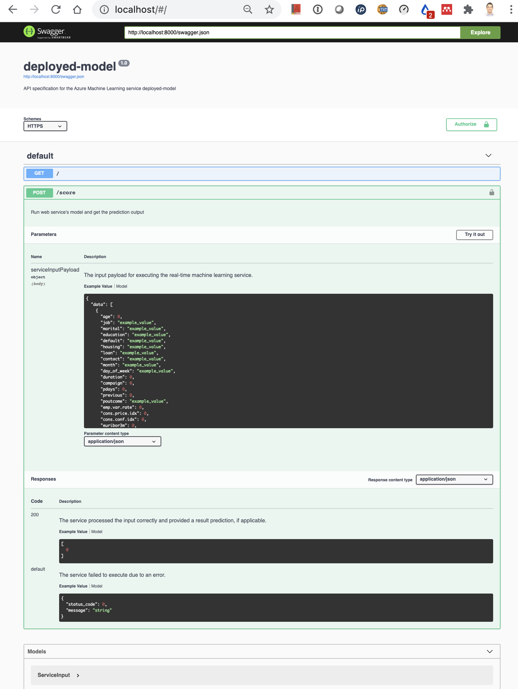
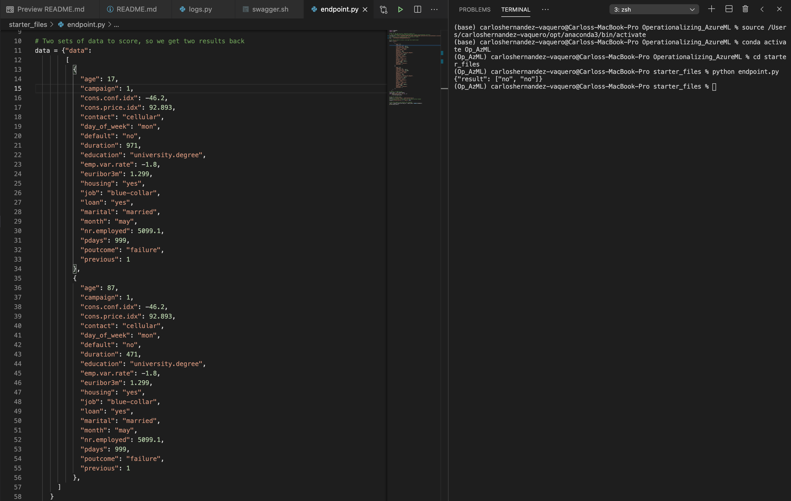

# Operationalizing Azure ML

## Introduction

In this project we are experimenting with the complete toolchain of Azure for creating and deploying a ML model. For this purpose, we generate and pick a model using AutoML in Azure ML and deploy it to a web service as an Azure Container Instance. Then we will play with the swagger REST API and verify the logs generated in Azure Application Insights.

We are using a [Dataset](https://archive.ics.uci.edu/ml/datasets/Bank+Marketing) distributed and maintained by the University of California Irvine. This dataset was generated by a Portuguese banking institution classifying which marketing campaigns in the form of phone calls resulted in closing a deposit contract. The dataset records personal parameters of the participants of the marketing campaign like the job, education, marital status, economic situation (loans, owned housing, ) as well as other parameters related to the call and offered product, like date, time and duration of the call, employee number and euribor value.

## Architectural Diagram

As we can see in the next diagram, we are using the next components of Azure:
+ Azure ML logic elements
    + Workspace, which is a container of all elements in Azure ML
    + A dataset which contains the Bank marketing data, importing the CSC file
    + AutoML through the wizard and inside a pipeline
    + A pipeline to automate the run including AutoML
    + Experiments collecting the runs and child runs for training the model
    + Endpoints for running inferences and to trigger the pipeline
    + A Jupyter Notebook to create in code a pipeline with AutoML and its deployment
    + Model registry to store our generated models
+ Azure Application Insights for collecting logs
+ Compute resources
    + Azure Container Instance for one of the Endpoints
    + A compute cluster for the training of AutoML
    + A compute instance for running the Jupyter Notebooks inside Azure ML

## Key Steps

### Creating and picking a ML model with AutoML

Once we have an Azure ML Workspace, we are going to create a Dataset with the mentioned Bank Marketing data. This is a simple and required step to launch AutoML. We can create the Dataset directly while creating an AutoML run or in the Datasets section before starting the AutoML wizard.

In the next picture we can see the generated Dataset.

If we click on the dataset ("Bank-marketing"), we can see the details of the dataset, including the Web URI, source of the data stored in the CSC file.

The next step is to launch an AutoML run as a Classification problem with this Dataset, selecting the prediction column as the last one in the csv file, which is "y". For the AutoML to be able to run, we create a compute instance of type Standard_DS12_v2 and select "Explain best model", so that we are given the list of generated models. The AutoML run will take near to an hour to complete and show the results of each algorithm used.

In the next picture we can see the accuracy achieved by each of the tested algorithms by AutoML. As we could expect, an Ensemble algorithm obtains very good results, since it is combining the results of several other algorithms.

In the next picture we can see some of the metrics of the best performing algorithm ("Voting ensemble"). Azure presents us a really long list of metrics, so that we can select the one which is most convenient depending on the type of problem or our preference.

### Deploying the best performing model to an HTTP endpoint

Next, we are going to deploy this model into an Azure Container Instance (ACI), so that we can directly run predictions over HTTP. We can also see in the next picture that "Application Insights" is enabled ("true").

Once this is done, Azure "automagically" provides a swagger.json as API documentation. Since we have enabled logging, we get logs for all what is going on. We can see that by running logs.py and with the results shown in the next picture

We can run locally a docker image (see "swagger.sh") to run the Swagger UI, so that we see the graphical representation of the REST API, contained in the swagger.json file.

### Scoring

Now we are able to make requests against our endpoint and see the returned inferences. In our case, we have a small Python script ("endpoint.py") which composes a HTTP POST request with 2 example inputs and the authentication key required, since we enabled authentication

As we can see, the infered outputs by the model is in both cases "no".

### Creating pipelines

As a final step, we are creating a Pipeline using the Python SDK in a Jupyter Notebook (see aml-pipelines-with-automated-machine-learning-step.ipynb). The pipeline is simply doing the same steps as previously, but in an automated fashion. The pipeline can be triggered either manually or via a REST API call.

We can see in the next picture the graphical representation of the pipeline (though it has been created by code). Note the Bank marketing Dataset and the Automl modules

From the Notebook perspective, we can see the run has been completed, including the deployment of the pipeline in a REST endpoint

From the Azure ML web UI we can see that the pipeline has been created and already run several times

The pipeline endpoint can be seen in the pipelines and endpoints sections

The next picture shows the view from the "Endpoints".

And the next picture shows the same endpoints from the "Pipeline endpoints" tab, inside Pipelines.

The pipeline REST endpoint status can be seen in the next picture.

We can also see the REST endpoint and its status by entering in the specific pipeline.

## Screen Recording

In the next video we show a demo of some of the highlights of the Azure ML experiments we have performed

https://www.youtube.com/watch?v=9pLv7IlXVRI

## Future work

This was a nice experimentation project, but it would have been even nicer to use our own Dataset to deploy it and solve a real problem. Rather than using this well-known dataset, it would have been more valuable to use a novel Dataset. This of course enters in the area of "creating something useful" instead of experimenting with Azure, as it was the target of this project. Of course, we would need to also consider in this case the costs related to keeping the required Azure resources running (e.g. Azure Container Instance for model scoring).

Additionally, we would like to investigate the option of automating the whole process by using [Azure templates](https://docs.microsoft.com/en-us/azure/azure-resource-manager/templates/overview#:~:text=To%20implement%20infrastructure%20as%20code,and%20configuration%20for%20your%20project.), even for the deployment of pipelines. A second similar idea would be to integrate the development of new models with a workflow in [Azure DevOps](https://azure.microsoft.com/en-us/services/devops/), which is very commonly used as a CI/CD tool in other environments. These 2 ideas are inline with the current trend to define "everything as code" and version control it. This would be required if we plan to work in collaboration with other developers or researchers.
