# Operationalizing Azure ML

## Introduction

In this project we are experimenting with the complete toolchain of Azure for creating and deploying a ML model. For this purpose, we generate and pick a model using AutoML in Azure ML and deploy it to a web service as an Azure Container Instance. Then we will play with the swagger REST API and verify the logs generated in Azure Application Insight

We are using a [Dataset](https://archive.ics.uci.edu/ml/datasets/Bank+Marketing) distributed and maintained by the University of California Irvine. This dataset was generated by a Portuguese banking institution classifying which marketing campaigns in the form of phone calls resulted in closing a deposit contract. The dataset records personal parameters of the participants of the marketing campaign like the job, education, marital status, economic situation (loans, owned housing, ) as well as other parameters related to the call and offered product, like date, time and duration of the call, employee number and euribor value.

## Architectural Diagram

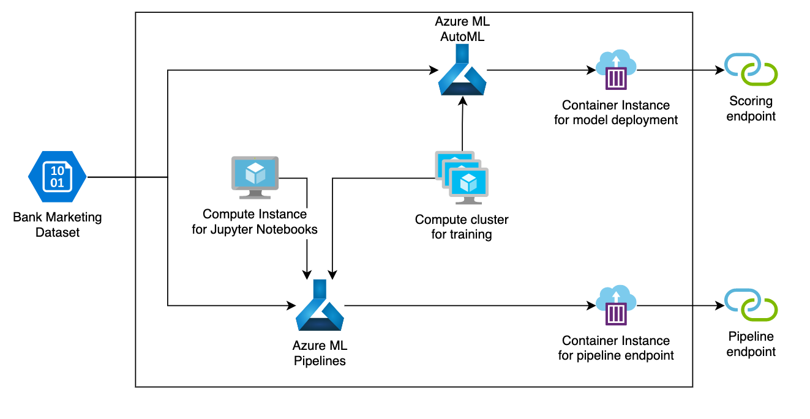

## Key Steps

### Creating and picking a ML model with AutoML

Once we have an Azure ML Workspace, we are going to create a Dataset with the mentioned Bank Marketing data. This is a simple and required step to launch AutoML. In the next pictures we can see the generated Dataset.

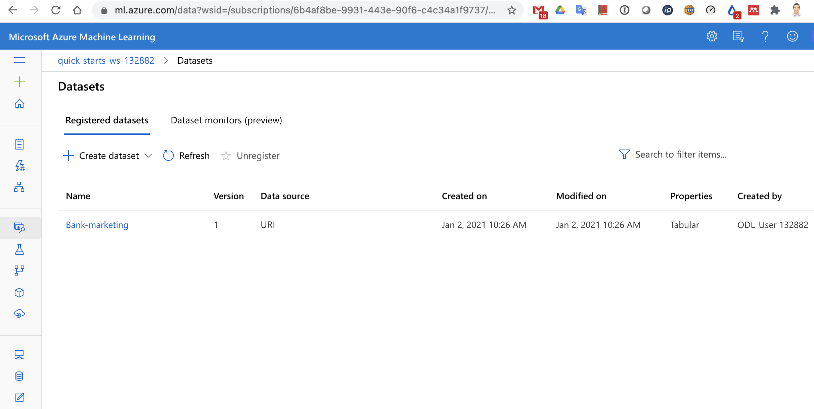

We now launch an AutoML run as a Classification problem with this Dataset, selecting the prediction column as the last one in the csv file, which is "y". For the AutoML to be able to run, we create a compute instance of type Standard_DS12_v2 and select "Explain best model", so that we are given the list of generated models. The AutoML run will take near to an hour to complete and show the results of each algorithm used.

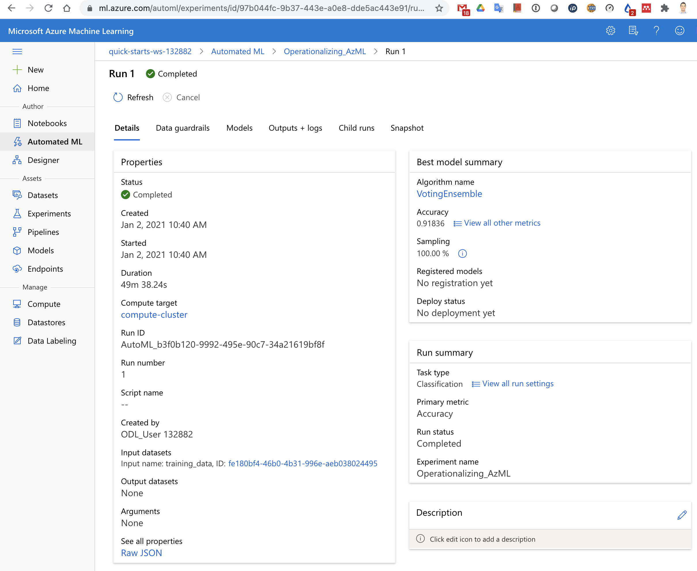
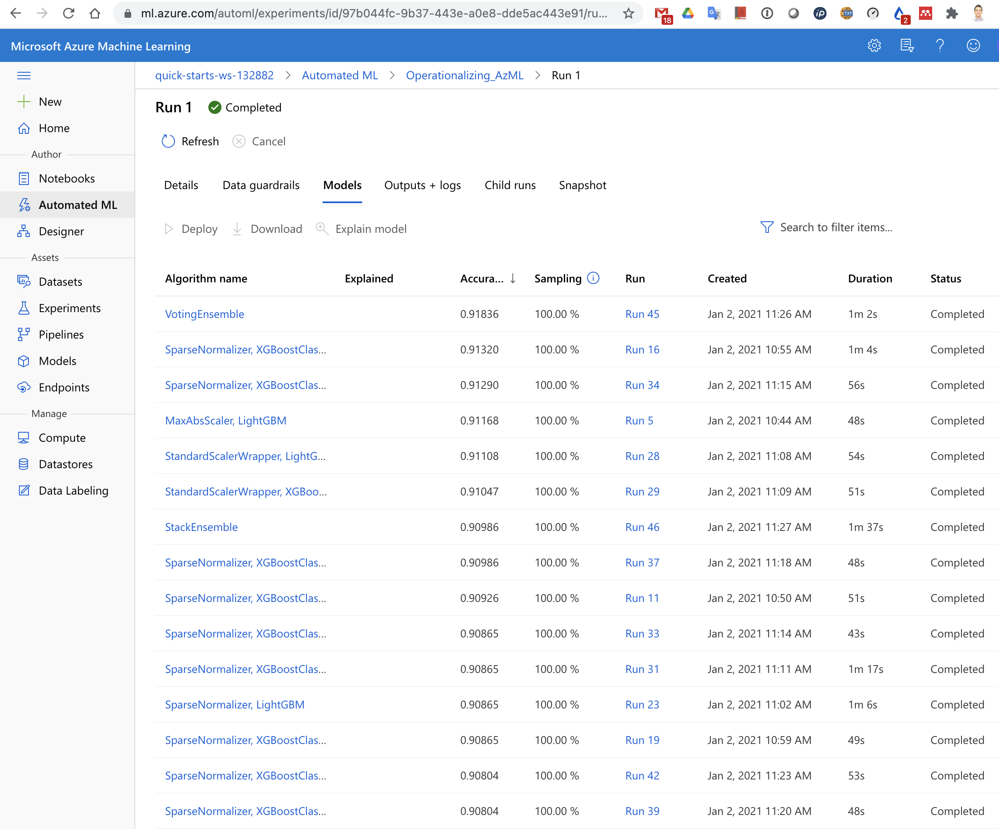

In the next picture we can see some of the metrics of the best performing algorithm ("Voting ensemble")

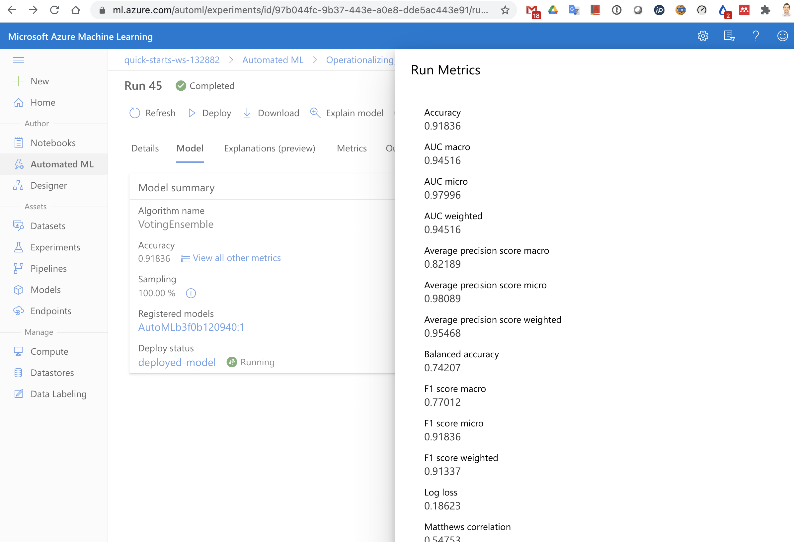

### Deploying the best performing model to an HTTP endpoint

Next, we are going to deploy this model into an Azure Container Instance (ACI), so that we can directly run predictions over HTTP. We can also see in the next picture that "Application Insights" is enabled ("true").

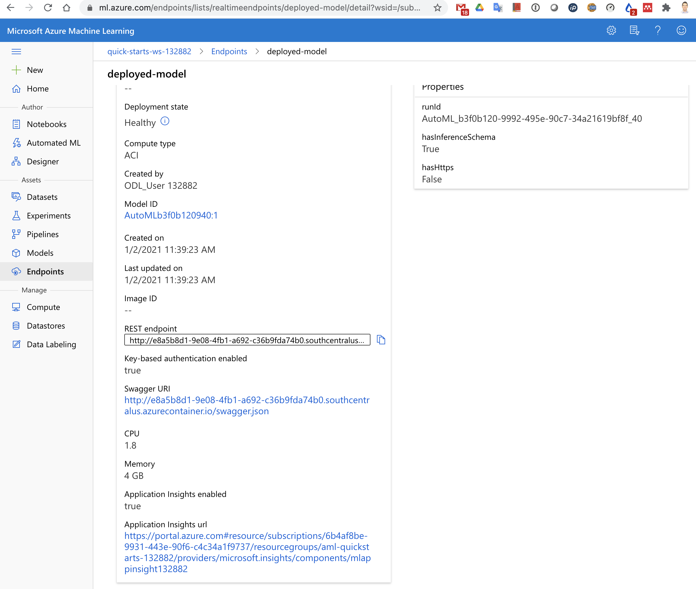

Once this is done, Azure "automagically" provides a swagger.json as API documentation. Since we have enabled logging, we get logs for all what is going on. We can see that by running logs.py and with the results shown in the next picture

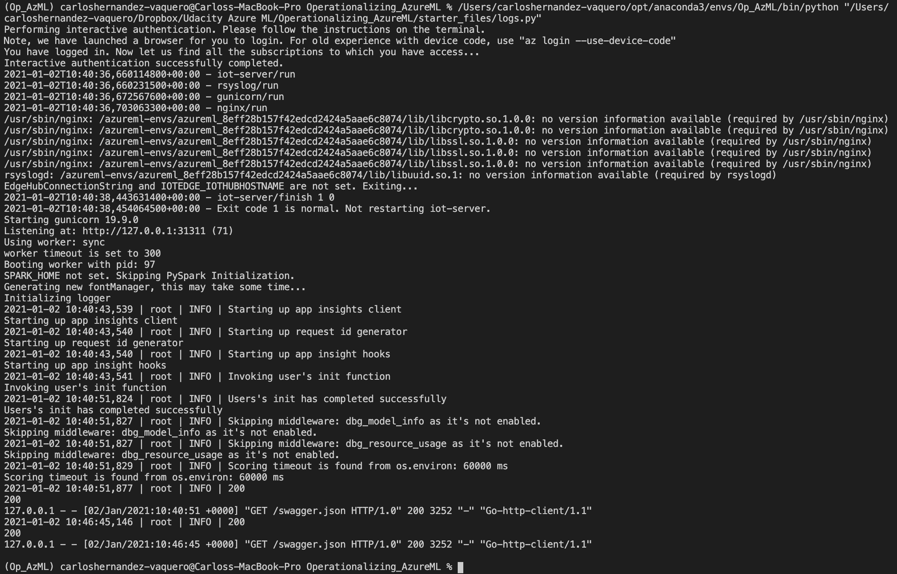

We can run locally a docker image (see "swagger.sh") to run the Swagger UI, so that we see the graphical representation of the REST API, contained in the swagger.json file.

### Scoring

Now we are able to make requests against our endpoint and see the returned inferences. In our case, we have a small Python script ("endpoint.py") which composes a HTTP POST request with 2 example inputs and the authentication key required, since we enabled authentication

As we can see, the infered outputs by the model is in both cases "no".

### Creating pipelines

As a final step, we are creating a Pipeline using the Python SDK in a Jupyter Notebook (see aml-pipelines-with-automated-machine-learning-step.ipynb). The pipeline is simply doing the same steps as previously, but in an automated fashion.

We can see in the next picture the graphical representation of the pipeline (though it has been created with code). Note the Bankmarketing Dataset and the Automl modules

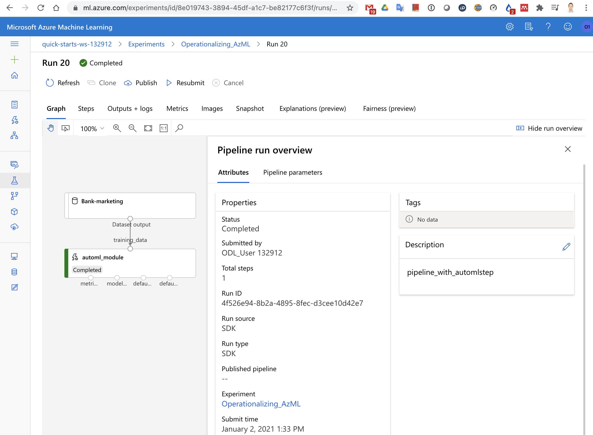

From the Notebook perspective, we can see the run has been completed, including the deployment of the pipeline in a REST endpoint

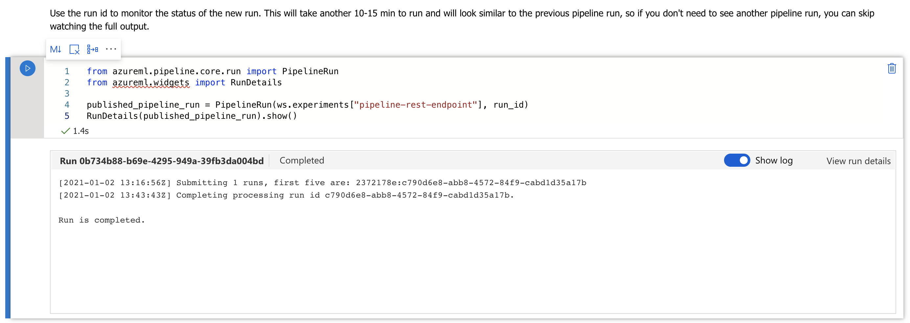

From the Azure ML web UI we can see that the pipeline has been created and already run several times

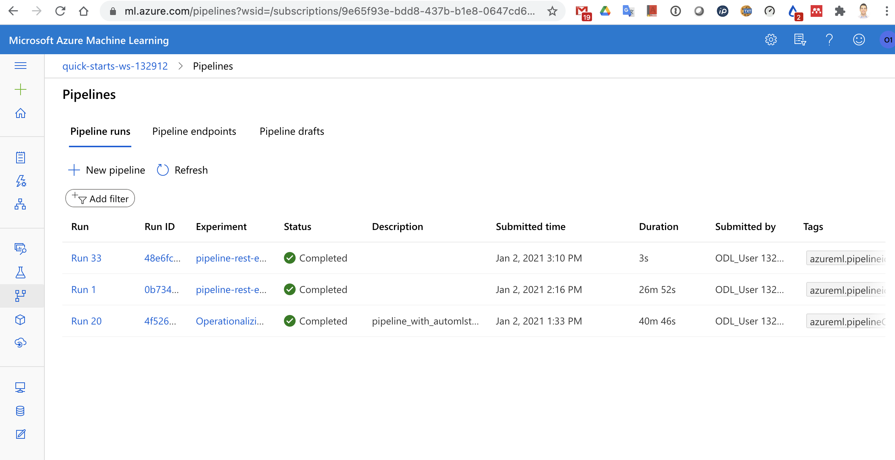

The pipeline endpoint can be seen in the pipelines and endpoints sections

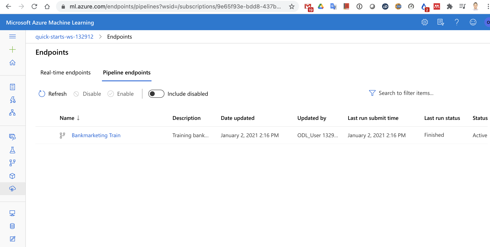
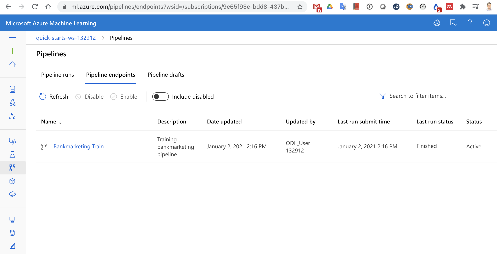

Finally, the pipeline REST endpoint status can be seen in the next pictures

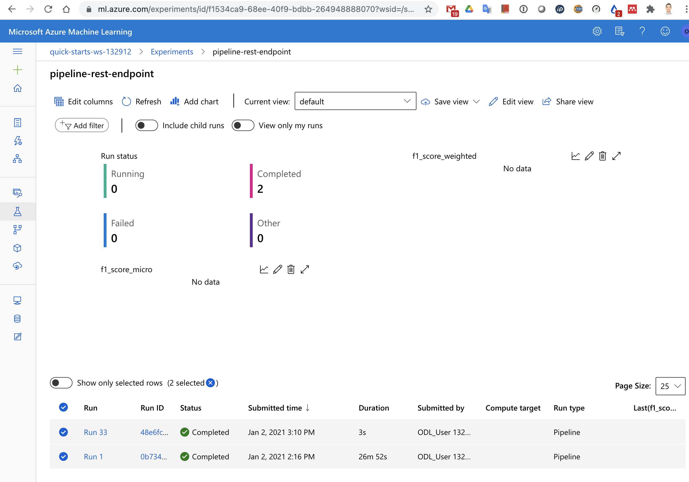
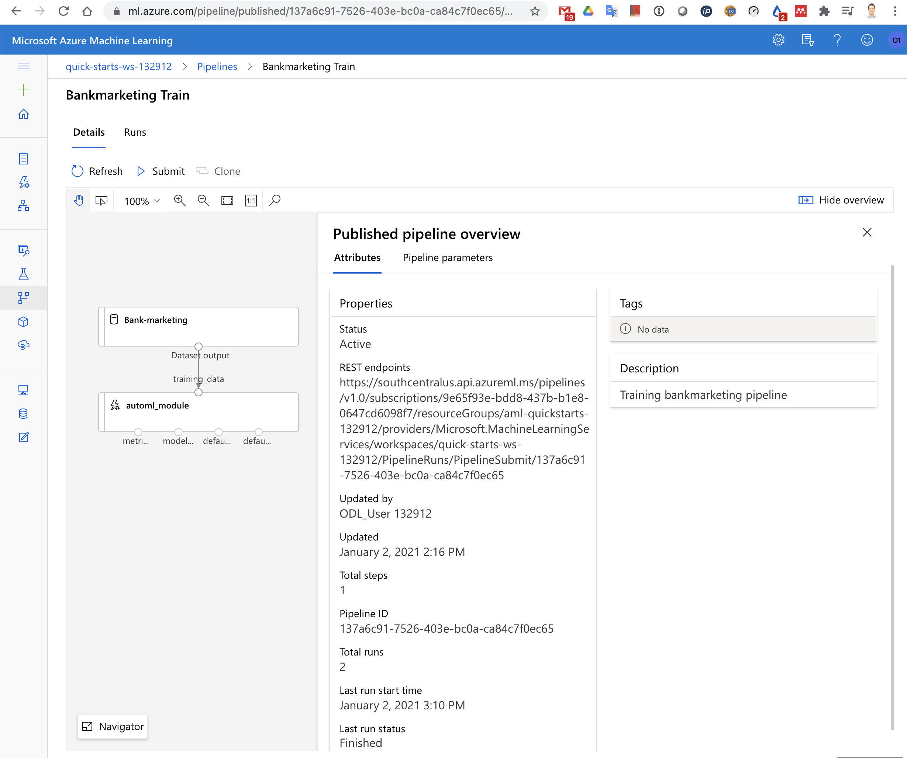

## Screen Recording

In the next video we show a demo of some of the highlights of the Azure ML experiments we have performed

https://www.youtube.com/watch?v=9pLv7IlXVRI

## Future work
This was a nice experimentation project, but it would have been nicer to use our own Dataset to deploy it to solve a real problem.

Additionally, we would like to investigate the option of automating the whole process by using templates, even for the deployment of pipelines.